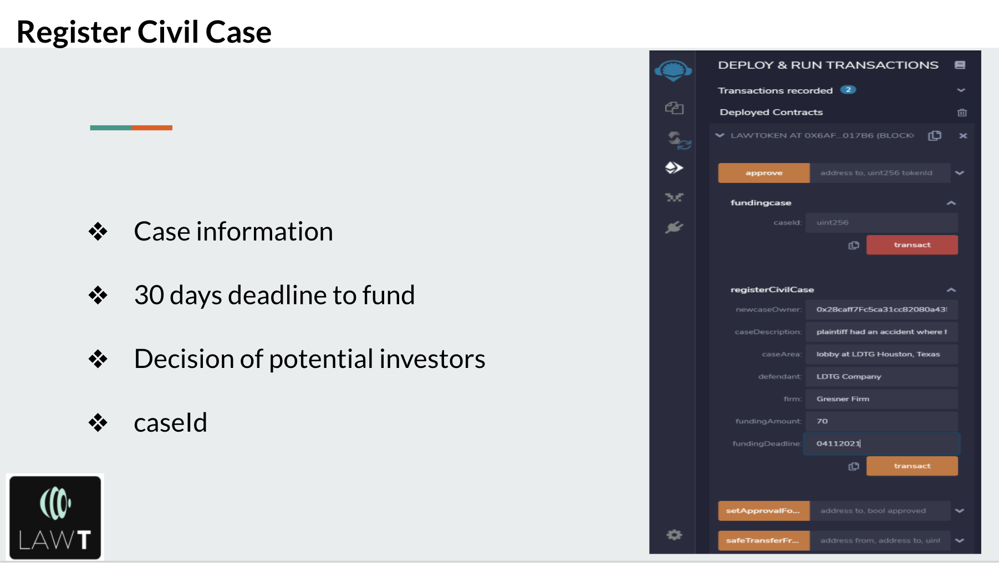
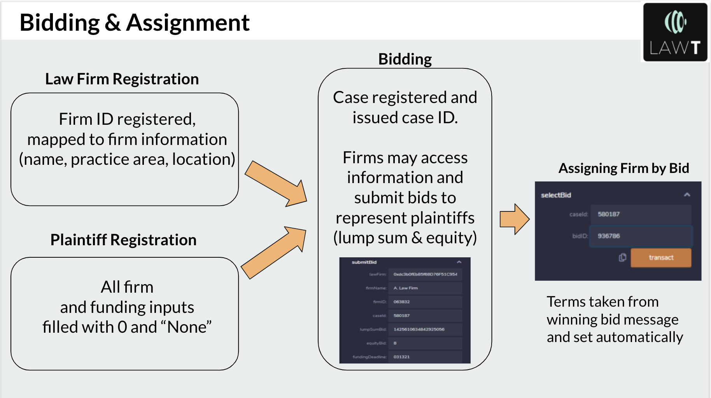
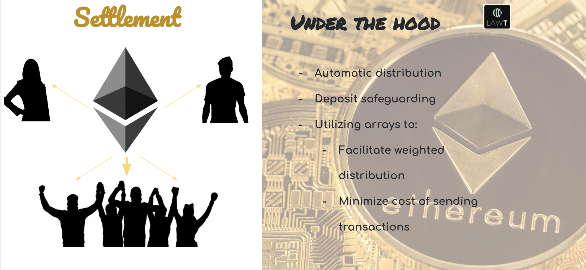

# Project-3_Law-Token

## Members
* Jexi Amaris
* Anthony "Jack" Fazzone
* Gonzalo Garcia
* Olanrewaju Ogubufunmi
  

## Description

In civil litigation, when a potential plaintiff does not wish, or is not able, to foot the cost of legal services up front, many attorneys will elect to take a share of the possible judgment instead (~30% in many cases) on a contingency basis. In this way, the plaintiff is not required to pay anything if the case is not won. Law Token attempts facilitate third-party investments in these lawsuits, whereby Ether is offered to cover legal and other expenses in the case in exchange for tokenized equity in the judgment, should the case win. We hypothesize that in pooling the risk inherent to contingency payouts, Law Token would permit plaintiffs to secure funding without having to sell as much equity as 30%, a savings in the equity of the ultimate judgment which becomes especially important for cases involving high medical expenses resulting from injury, worker's compensation, and other lawsuits in which a large portion of the ultimate judgment essential to properly compensating the plaintiff.

 
<h2> Project Pipeline</h2>

## LawToken.sol

I. Create a function to initiate case on the blockchain. Function should require:  
<ol>A. Attorney details: 
<ol>Name of attorney </li> 
Name of law firm</ol></li></ol>
	

<ol>B. Case details:
<ol>Description of case </li> 
Date and location of accident </li> 
Details of injury to victim </li> 
Opposing insurance company </li> 
Estimated value of damage </ol></li></ol>

<ol>C. Financial details:
<ol> Amount requested to fund case (attorney's expenses) </li> 
Deadline to secure funding </li> 
Estimated range of settlement </li> 
Setllement percentage split </li> 
Graduated incentive fee structure of attorney </li></ol></ol>

II. Once value determined in <strong><em>step I</em></strong> is reached, mint tokens that represent equity in judgment to attorney and investors 

## Minting

Our goal is to grant equity in judgments to attorneys and investors

There are three key roles in the process
* The attorneys firm; who grants representation to the custodian 
* SQUIRE, who in his role of Custodian holds the assets and the keys to mint tokens. 
* Investors - Who are the holders of the wrapped token. 

Once the value determined for the civil case is reached we crowd sale and mint LAW-T tokens that represent equity in judgment

SQUIRE exchanges assets for wrapped tokens with investors and this is done through minting LAW-T tokens 

How to implement the system ?  
• The custodian (Squire) has the ability to mint exchangeable fungible tokens on Ethereum 
• Squire is the sole role that can mint tokens 
• The contract is built on ERC20  to meet standardization 
• To issue secured contracts, we integrate the OpenZeppelin library 
• Investors can use tokens to transfer and transact like any other token in the Ethereum ecosystem
• All These transactions are public and available in the blockchain and can be viewed transparently by anyone through a block explorer.

## Settlement

III. Once judgment ETH reaches contract, distribute balance according to addresses' respective equity 

IV. Bundled equities in numerous cases to further diversify risk and facilitate financing  

## Potential Additions

1. Use previous cases to predict total legal expenses and/or likely payment if case is won -- case scoring (machine learning?) 
2. Transferrable tokens for each case or bundle (market exchange) 
3. Nice-looking landing page listing open cases to invest in 

